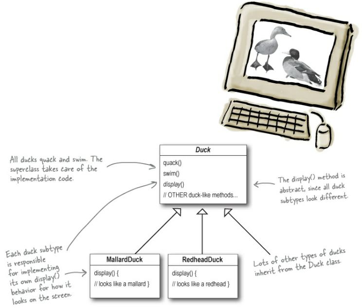
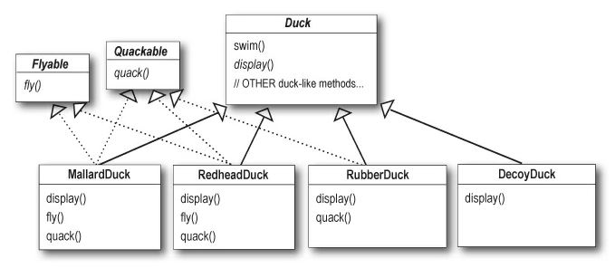
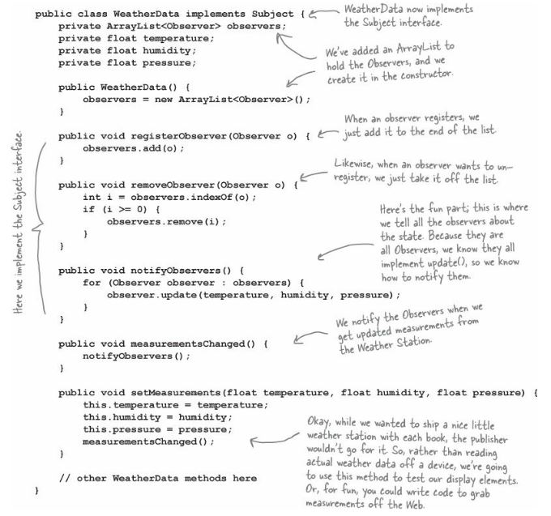

### Head First Design Patterns
Eric Freeman and Elisabeth Robson

This book is for computer professionals specially developers who want to improve their coding skills. It is a good book and I like the way the author put a lot of images for the readers to visualize and understand the topic. Well I’m not a fan of reading book since it makes me sleepy and bored however for a person like me who doesn’t usually read books I can say that those pictures help to make the book and topic more interesting.

Here are the summary and learnings I have gained for each pattern.

### Strategy Pattern

Strategy defines a family of algorithms encapsulates each one and makes them interchangeable. In the book they used a duck pond simulation game called “SimUDuck” as an example. The game can show a large variety of duck species swimming and making quacking sounds. The initial design is a Duck superclass which all other duck types inherit.

Then decided to add flying duck in their app by adding fly behavior in the duck superclass.

However, there is a problem the developer failed to notice that not all ducks should have the ability to fly. They have added a behavior which are not appropriate for other duck subclasses. 

In the book they have thought of adding wooden decoy ducks which cannot quack or fly. The developer thinks of creating flyable and quackable interface which will be only implemented by duck subclasses. It will solve some part of the problem but it will cause code duplication since you need to add the implementation in duck subclasses. 

So finally, what they did to solve the problem is to encapsulate the fly and quack behavior and implements it in the duck abstract class. Then create a setter for fly and quack behavior.

In the book example, they have shown how they use the 4 major concepts of OOP (Abstraction, Encapsulation, Polymorphism, Inheritance). They have also applied 3 Object Oriented Principles
-	Encapsulation what varies
-	Favor composition over inheritance (Has – A can be better than is -a)
-	Program to an interface not an implementation

## Observer Pattern

Observer Pattern defines one-to-many dependency between objects so that when one object changes state, all its dependents are notified and updated automatically. In my opinion the concept is easy to understand but the implementation is tricky. One of the good example the book used is the newspaper subscription. When you subscribe to a publisher, every time there’s a new edition it gets delivered to you if you remain subscriber. They also said that **Publishers + Subscribers = Observer Pattern**. Here is a sample diagram how observer pattern works.

In the diagram above, the concrete subject need to implement the subject interface and the concrete observers need to implement the observer interface. The tricky part and the one it took me so long to figure out is, how can you register the concrete observer and how can you update them if there is an updated in the concrete subject. Below is the weather station example in the book.

Observer is a pattern for communicating state to a set of objects in a loosely coupled manner. This pattern is recommended to use for one to many relationships when subjects wants to notify its dependent objects automatically.
